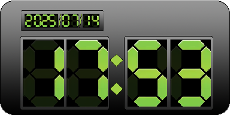
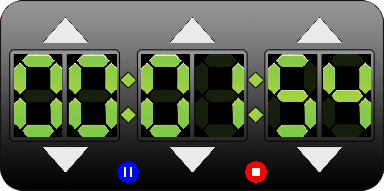

  
[Gadget System Framework (GSF)](https://github.com/cookgreen/GadgetSystemFramework) based Desktop Gadgets Collection

GSF is a desktop gadget framework developed in Python. This framework aims to provide users and developers with a set of desktop gadgets for Windows 10/11.

This code repository is intended to provide some basic desktop gadgets based on GSF, including but not limited to:

* Digital Clock
* Digital timer
* Stock Index Viewer
* Weather query
* Gmail Notification
* Internet Radio

You need to clone the repository and save it to `C:/Users/[Your User Name]/AppData/Roaming/GSF/gadgets` on your Windows system.

## Screenshots
### Digital Clock  

  
### Digital Timer  

  
## License
GNU LGPL
